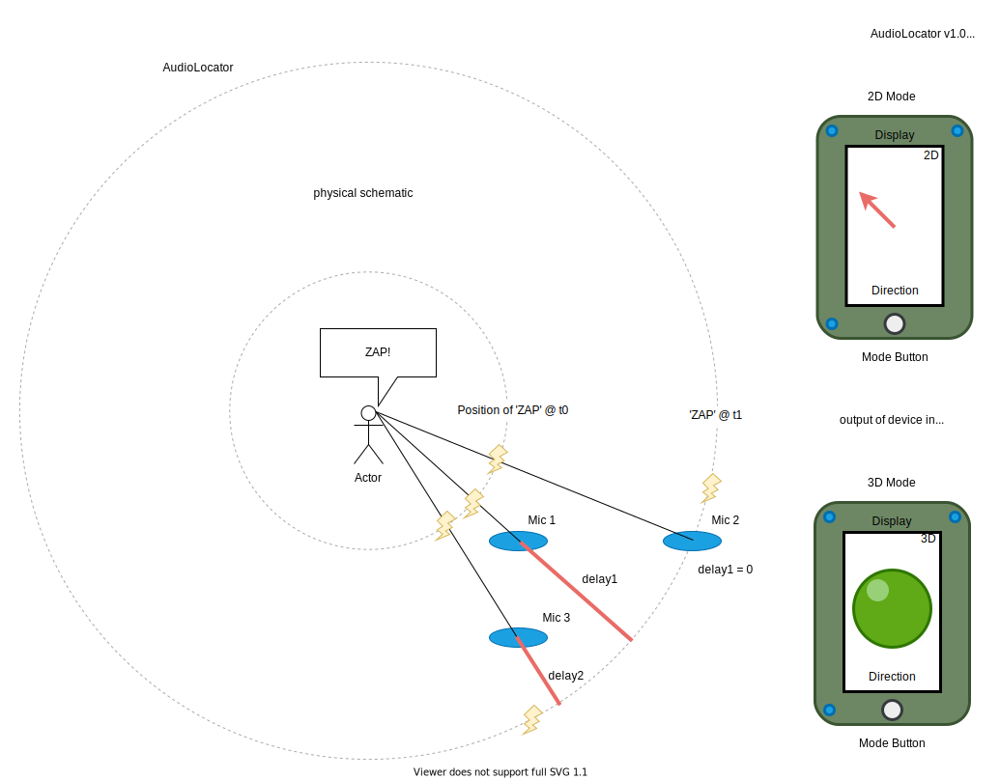
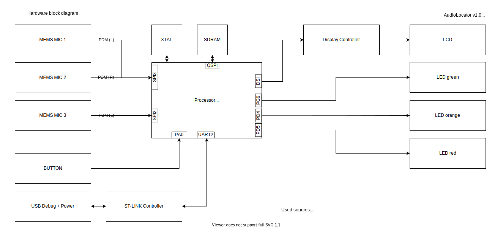
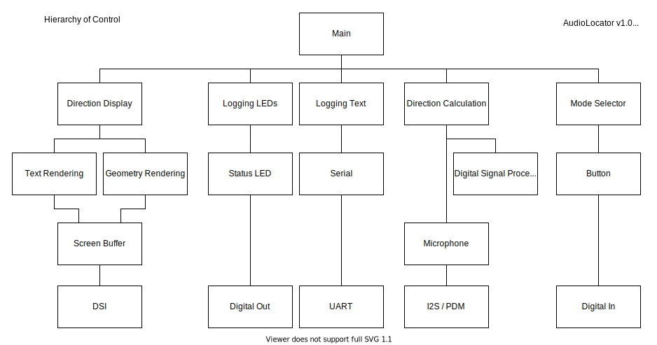
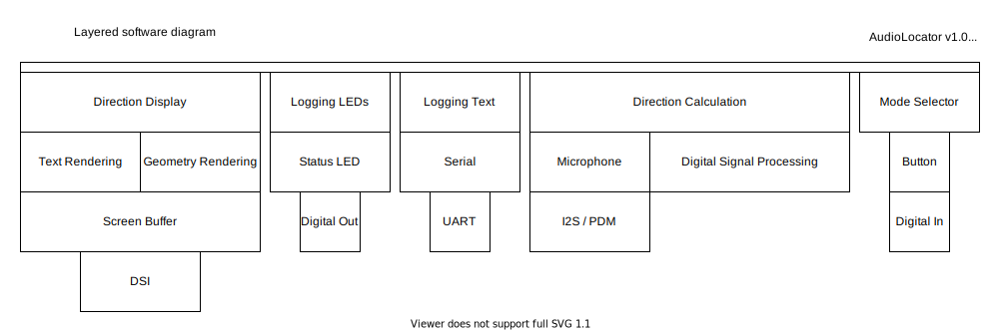

# Exercise 1
</img>
## What it does
The Audio-Locator can calculate a 3 dimensional direction towards an audio signal (voice, clap, beep). The device will point with a displayed graphic (2D-mode: compass needle, 3D-Mode: 2D bubble) on an LCD towards the origin of the most recent loud sound.

### 🔨 How does it work
With DSP-functions (correlation) the 3 audio signals are compared with each other. A distinct sound, e.g. a clap, should create a similar signal for each microphone, with a slight time delay. Based on these time delays the direction can be calculated via trilateration.

### ⚠️  Limitation
> The system is based on 3 microphones, it can calculate the position of the audio source in 3D space, though it can't differenciate between directions above and below the microphone-plane, this would require a fourth microphone which is placed above or below this plane.
As the microphones are highly directional, this project will focus on the frontal hemisphere.

### 💡 Applications
- give feedback in user interactions with gadgets to communicate a device is listening to the right person (amazon echo light ring)
- locate a bird in a tree
- locate a leakage in a machine
- fire laser ray at mosquittos
- calculate a pencil's position on a paper
- remove background noise from audio stream

### ⚙️ Required Components
- Fast Processor (STM32F469)
- 3 MEMS Microphones
- Display
- Buttons for mode switching (Hemisphere selection, 2D/3D mode)
- USB port to power
  
👷‍♂️ Required during development
- USB for debugging
- Serial debug port
- Three status LEDs

### Architecture
</img>
</img>
</img>