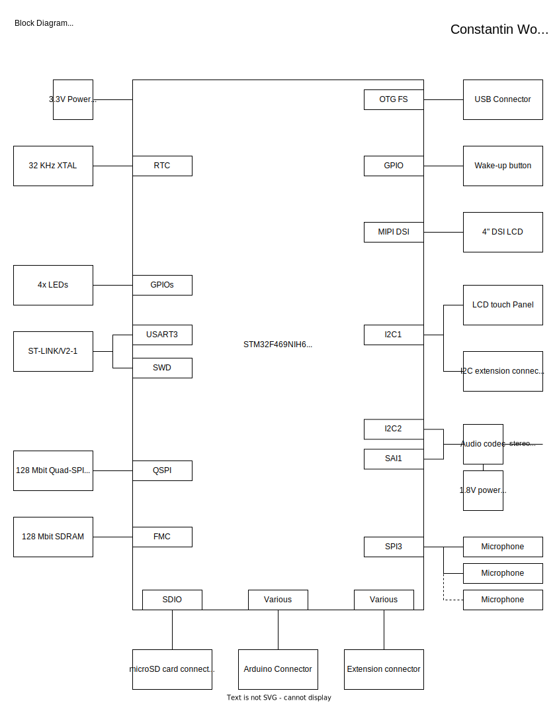

# STM32F469I-DISCO
## Hardware block diagram
</img>
## Processor
- STM32F469NIH6
  
## Flash, Ram, Other memory

### Internal
- 2 Mbytes of Flash
- 384+4KB RAM
  
### External
- 128-Mbit Quad-SPI NOR Flash
- 128-Mbit SDRAM

## Special peripherals (3-5)
- MIPI DSI LCD display
- 3 Mems microphones
- Audio Codec
- Flexible Memory Controller

## ADC Features
- 12-bit
- 16 Channel
  
## Cost / Availability

- 1580Pcs @ Mouser 20,94€

# STM32H745I-DISCO
## Hardware block diagram
</img>

## Processor
- STM32H745XIH6
- STM32H750XBH6
  
## Flash, Ram, Other memory

### STM32H745XIH6:
- 2MByte Flash
- 1MByte RAM
- 16KByte L1 Cache

### STM32H750XBH6
- 28KBytes Flash
- 1MByte RAM
- 16KByte L1 Cache 

### External
- Ext. 128-Mbit SDRAM
- 2x512-Mbit Quad-SPI Flash memory 
- ext. storage: 4-Gbyte eMMC

## Special peripherals (3-5)
- Ethernet w/ PoE
- CAN
- HDMI-CEC
- 12Bit DAC
- 
## ADC Features
- 3× ADCs with 16-bit max. resolution (up to 36 channels, up to 3.6 MSPS)

## Cost / Availability

- STM32H745XIH6 : 0Pcs @ Mouser/Digikey 21,19€ (4 Weeks lead time)
- STM32H750VB : 10000Pcs @ Mouser 10,54€
