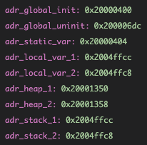

# Memory addresses

```
int global_init = 1;
int global_uninit;

void mem_test()
{
  static int static_var_in_function = 2;
  int var_in_function_1 = 3;
  int var_in_function_2 = 3;

  volatile int adr_global_init = &global_init;
  volatile int adr_global_uninit = &global_uninit;
  volatile int adr_static_var = &static_var_in_function;
  volatile int adr_local_var_1 = &var_in_function_1;
  volatile int adr_local_var_2 = &var_in_function_2;
  volatile int adr_heap_1 = malloc(1);
  volatile int adr_heap_2 = malloc(1);
  volatile int adr_stack_1 = adr_local_var_1;
  volatile int adr_stack_2 = adr_local_var_2;

  volatile int stop = 12;
}
```
## resulting addresses



excerpt from map file
```
Name             Origin             Length             Attributes
RAM              0x0000000020000000 0x0000000000050000 xrw
CCMRAM           0x0000000010000000 0x0000000000010000 xrw
FLASH            0x0000000008000000 0x0000000000200000 xr
*default*        0x0000000000000000 0xffffffffffffffff

...

 .bss.global_uninit
                0x00000000200006dc        0x4 build/main.o

...

 .data.global_init
                0x0000000020000400        0x4 build/main.o
                0x0000000020000400                global_init

...

 .data.static_var_in_function.0
                0x0000000020000404 


```

- `global_uninit` is in `bss` as uninitilized
- `global_init` is in `data` as initilized
- `static_var_in_function` is in `data`, as data must be kept between function calls of this function
- `adr_local_var_1` is not in map file, as the memory is temporarily allocates on stack
- all stack vars are places before end of RAM (`0x20000000 + 0x50000`)
- all heap vars are places after start of RAM (`0x20000000`)

- Stack addresses decrease for every allocation
- Heap addresses rise for every allocation

## dunders

```
__adddf3
__aeabi_d2f
__aeabi_dadd
__aeabi_ddiv
__aeabi_dmul
__aeabi_drsub
__aeabi_dsub
__aeabi_f2d
__aeabi_i2d
__aeabi_idiv0
__aeabi_l2d
__aeabi_ldiv0
__aeabi_ui2d
__aeabi_ul2d
__aeabi_uldivmod
__bss_end__
__bss_start__
__call_exitprocs
__deregister_frame_info
__divdf3
__dso_handle
__end__
__errno
__extendsfdf2
__floatdidf
__floatsidf
__floatundidf
__floatunsidf
__fp_lock_all
__fp_unlock_all
__heap_limit
__ieee754_powf
__ieee754_sqrtf
__init_array_end
__init_array_start
__libc_fini_array
__libc_init_array
__lock___arc4random_mutex
__lock___at_quick_exit_mutex
__lock___atexit_recursive_mutex
__lock___dd_hash_mutex
__lock___env_recursive_mutex
__lock___malloc_recursive_mutex
__lock___sfp_recursive_mutex
__lock___sinit_recursive_mutex
__lock___tz_mutex
__malloc_free_list
__malloc_lock
__malloc_sbrk_start
__malloc_unlock
__math_divzerof
__math_invalidf
__math_oflowf
__math_uflowf
__muldf3
__preinit_array_end
__preinit_array_start
__register_frame_info
__retarget_lock_acquire
__retarget_lock_acquire_recursive
__retarget_lock_close
__retarget_lock_close_recursive
__retarget_lock_init
__retarget_lock_init_recursive
__retarget_lock_release
__retarget_lock_release_recursive
__retarget_lock_try_acquire
__retarget_lock_try_acquire_recursive
__sclose
__seofread
__sf_fake_stderr
__sf_fake_stdin
__sf_fake_stdout
__sflush_r
__sfmoreglue
__sfp
__sfp_lock_acquire
__sfp_lock_release
__sinit
__sinit_lock_acquire
__sinit_lock_release
__sread
__sseek
__ssprint_r
__ssputs_r
__stack
__stack_base__
__subdf3
__swrite
__truncdfsf2
__udivmoddi4
```

