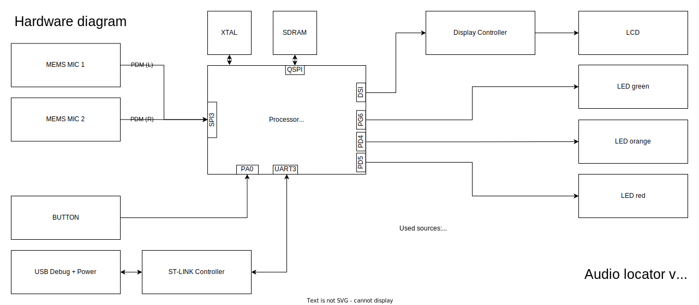
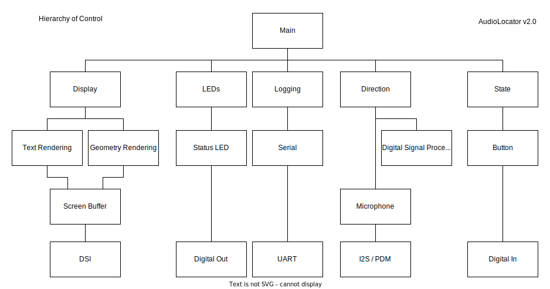
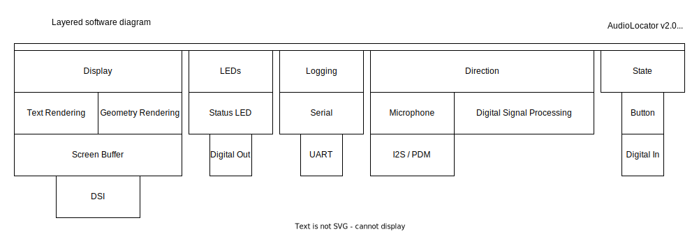
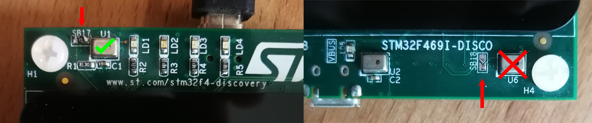

# Project Report - Audio Locator (Draft)

## Application description
The Audio-Locator can calculate a dimensional direction towards an audio signal (voice, clap, beep). The device will point with a displayed graphic (In-PCB-plane-mode: compass needle, In-Front-of-screen-mode: Line indicating direction out of the screen) on an LCD towards the origin of the most recent loud sound.

`TODO: ADD video`

## Hardware description
The device uses up to two MEMS microphones to locate the loudest sound in hearable proximity

- Fast Processor (STM32F469)
- 2 MEMS Microphones
- Display
- Buttons for mode switching
- USB port to power
- Audio Codec (cs43l22) + Headphone out

## Software description
With DSP-functions (correlation) the recorded audio signals (Mic 1 vs Mic 2) are compared with each other. A distinct sound, e.g. a clap, should create a similar signal for each microphone, with a slight time delay. Based on these time delays the direction can be calculated via trigonometric functions. 
The threshold for a sound to be detected can be set via commandline interface (`threshold 0-255`, smaller value = more detections). With a sampling rate of `16000 Hz` and a speed of sound of `343 m/s` having a phase delay of one sample means `2.14 cm` appart. With a microphone distance of `11.8 cm` means the soundwave arrives 5 samples later, if the sound came from the side of both microphones (β=180° or β=0°β).

- The `In-PCB-plane-mode` calculates direction of the sound within the plane that the PCB surface is in. The sound is expected below the display (towards headphone jack)
- The `In-Front-of-screen-Mode` calculates direction of the sound within the plane orthogonal to the screen which goes through both microphones. The sound is expected in front of the screen.

### Custom Modules
All major modules are packed into separate files `al_module.c/h`

`Main (al_main.*)`
> Main business logic of audio locator, separated from main to have a clean main. Initialized all required modules and uses state machine to switch between tracking modes.

`Button (al_button.*)`
> Handles user button via Interrupt, calls registered callback. In this case, it toggles between the tracking modes.
> 
 `Direction (...)`
> Processes PCM stream into direction of the loudest sound above a definable threshold.

 `Display`
> Displays the tracking results for the different modes. Supports two tracking modes as depicted in the first image, 2D planar and 2D above the screen.

 `Led`
> Handles the onboard LEDs. Turns them off in the beginning and toggles the 2nd and 3rd LED depending on the selected tracking mode.

 `Logging / Console`
> Handles logging to UART, Handle Serial IO to control parameters (Console part is mostly provided code that was adjusted for custom commands). Custom commands: `Threshold (0 - 255)` 0 = most sounds are detected, 255 = loud sounds are detected. `Ver` prints the version number. `mode (0,1)` toggles to `0` = in-PCB-plane-tracking, `1` = in-front-of-screen-tracking.
> 
 `Mics`
 > Pulse-Density-Modulation (**PDM**) Microphone capturing and conversion to Pulse-Code-Modulation (**PCM**) format. Uses DMA to capture stereo PDM data from two microphones. ST Library PDM2PCM is used to convert to PCM audio. For debugging SAI is used to stream the PCM to an audio codec which sends the signal to the headphone jack.

`State`
> Statemachine to toggle between tracking modes

### Code from other sources

- **CubeMX**: Generated the base project, this code is `provided AS-IS` as no License file was generated.
- **DSP**: To correlate the PCM signals (see `Apache-2.0`)
- **PDM2PCM**: To convert PDM to PCM (see `ST-SLA0047`)
- **BSP / HAL**: To setup/access the chip and peripherals (see `BSD-3-Clause`)

#### Limitations
The system is based on 2 microphones, it can calculate the position of the audio source in 2D space, thus it can't differentiate if the sound came from one side or the other. To compansate for that the tracking mode defines the direction the sound is expected from and also the plane in were the sound must be create on.

The PDM to PCM conversion isn't 100% clear and suffers from noise. This effects the overall performance for the detection and disables the threshold effect. This is an issue I wasn't able to locate with

## Architecture

## Build instructions
### How to build: Hardware

The required hardware is already available on the [STM32F469I-Discovery Board](https://www.st.com/en/evaluation-tools/32f469idiscovery.html). The discovery board comes with an ST-Link coprocessor that can be connected via USB-Mini to the programming/debugging computer.

**IMPORTANT**
> To capture the correct microphone setup it is required to close the solder jumper `SB17` and to open solder jumper `SB18`. This enables capturing microphone `U1` and `U2`. ⚠️ If this is not performed two microphones (`U6` and `U2`) are used which are too close and not calibrated for the processing of the software.
> 

### How to build: Software

The project is created with the stmCubeMX-IDE as a Makefile project and can be edited with any code editor and compiled with `make` from terminal.

Suggested IDE is **Visual Studio Code** IDE has a has useful extentions that help to build and debug the project
- [`stm32-for-vscode` - build/debug ](https://marketplace.visualstudio.com/items?itemName=bmd.stm32-for-vscode)
- `picocom` – serial communication (install via homebrew, apt)

After installation of these building and flashing can be triggered via `CMD+SHIFT+B`

**IMPORTANT:**
> The board I used was a Rev-B board, this is setup in the `Makefile` via the `-DUSE_STM32469I_DISCO_REVB` flag make sure to match that flag to your board revision.

**Useful notes for setting up a new `makefile` project for STM32:**
> - create a project via MX IDE, setup for makefile toolchain, tick box to copy .c and.h files into directory (code generator)
> - in vscode install stm32-for-vscode extension
> - open stm32-for-vscode panel hit build
> - see it failing failing with undefined reference to '__errno'
> - open generated file STM32-for-VSCode.config.yaml go to linkerFlags: and add line with - -specs=rdimon.specs
> - hit build again and it should compile
> - hit Flash STM and it should flash your connected device
### How to power
- The discovery board comes with a ST-LINK coprocessor (Mini-USB) when connected to host computer, the USB provides power and a link to debug.

### How to debug

Debugging the system was done in five ways:
1. Using the VSCode debugger with break points, call stack, variable values, registers.
2. Using the Display to draw relevant PCM / PDM values as a waveform
3. Using the Serial (`logging_log`) to print values of different types to the console
4. Using the headphone jack checking the pdm-to-pcm conversion acoustically
5. Using an oscilloscope to check the PDM clock at the microphones (requires scratching free a trace to access it, see right to `U1` you can see a bare copper trace)

## Future
### Get ready for production
Adding more microphones reduces the need for setting a tracking mode, a 3rd microphone can track sounds in one 3D-hemisphere, by adding a 4th microphone (which is not in the same plane as the 3 other microphones) a full 3D sound direction can be calculated without specifing a tracking mode. Having further microphones with more distance could even calculate/estimate the position of a sound source (if reflections are low).

This functionality can bepacked into a small library so either a small Cortex-M coprocessor can output directional data via I2C / UART or used alongside on the main processor.
A small dev-kit with such a coprocessor and external microphones will be developed so developers can easily test this system.

This library needs to be encapsulated and documented, so it is easy for other developers to get directional tracking into their project.

The minimal requirements for such a coprocessor need to be calculated and varyfied.

### Applications and features
This software and hardware solution (dev-kit) has a lot of potential for human-computer interactions
- Device awareness and feedback (similar Amazon Echo)
- Robot interaction, e.g. home assistent robots locating and differentiating users, learning locations

But also locating and tracking of objects and animals is a potential field of application
- bird locator
- gas leak finder

Possible future features:
- Background noise removal in audio calls with moving participants
- 3D-USB microphone with streaming of tracked sound locations
- Multi object location tracking

### Licenses
This project is based on existing code libraries, when using this project please check and comply to the listed licenses.

- [BSP – BSD-3-Clause](Drivers/BSP/STM32469I-Discovery/LICENSE.txt)
- [CMSIS – Apache](Drivers/CMSIS/LICENSE.txt)
- [HAL – BSD-3-Clause](Drivers/STM32F4xx_HAL_Driver/LICENSE.txt)
- [Middleware – BSD-3-Clause & ST-SLA0044](https://www.st.com/content/ccc/resource/legal/legal_agreement/license_agreement/group0/59/57/63/12/cf/a6/47/65/SLA0044/files/SLA0044.txt/jcr:content/translations/en.SLA0044.txt)
- [PDM2PCM - ST-SLA0047](https://www.st.com/content/ccc/resource/legal/legal_agreement/license_agreement/group0/73/b4/79/b9/5a/e6/4a/9e/SLA0047/files/SLA0047.txt/jcr:content/translations/en.SLA0047.txt)

---

<!-- # Troubles
## Tasks to complete
## Blocking items -->
